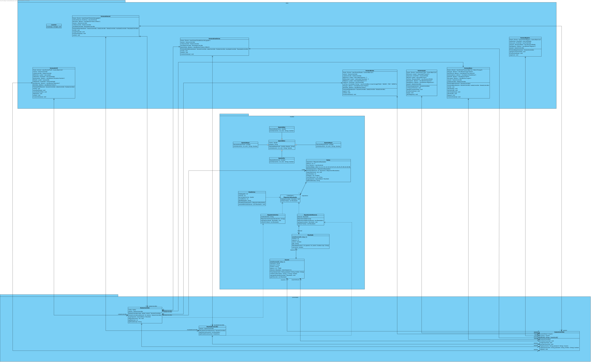

# Casino Black Cat

Aplicación de escritorio que simula un casino con ruleta, desarrollada en Java con Swing como proyecto académico para el curso de Programación Orientada a Objetos (UFRO).

## Tecnologías

- Java 17
- Java Swing
- Maven

## Estructura del proyecto
src/main/java/
├── controlador/    # SessionController, RuletaController, ResultadoController
├── modelo/         # Lógica de negocio, apuestas, repositorios
└── vista/          # Ventanas Swing

## Funcionalidades

- Registro e inicio de sesión de usuarios
- Depósito de saldo ficticio
- Apuestas a color (rojo/negro) y paridad (par/impar)
- Historial de jugadas persistido en archivo CSV por usuario
- Estadísticas de juego (victorias, racha máxima, tipo más jugado)

## Ejecutar el proyecto

```bash
mvn clean package
java -jar target/casino-blackcat-1.0.0.jar
```

## Diagrama de clases



## Iteraciones

| # | Tema |
|---|------|
| 01 | CLI en un único archivo |
| 02 | Login y registro con Swing |
| 03 | Aplicación de SRP |
| 04 | Patrón MVC y encapsulamiento |
| 05 | Relaciones de dependencia y asociación |
| 06 | Round-Trip con Visual Paradigm y módulo de estadísticas |
| 07 | Herencia y polimorfismo en jerarquía de apuestas |
| 08 | Interfaz `IRepositorioResultados` y principio DIP |
